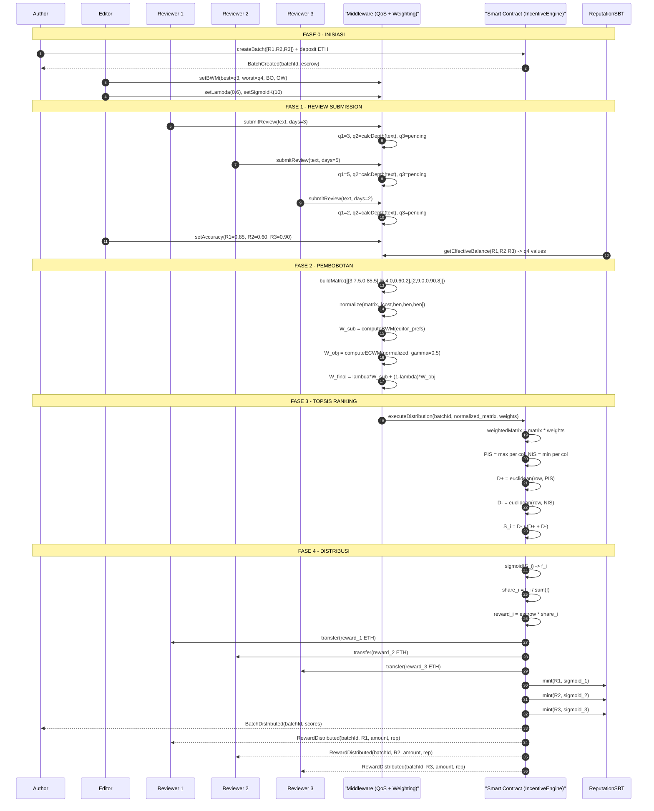

# Sequence Diagram - Alur Distribusi End-to-End

```mermaid
sequenceDiagram
  autonumber
  participant A as Author
  participant E as Editor
  participant R1 as Reviewer 1
  participant R2 as Reviewer 2
  participant R3 as Reviewer 3
  participant MW as "Middleware (QoS + Weighting)"
  participant SC as "Smart Contract (IncentiveEngine)"
  participant SBT as ReputationSBT

  Note over A,SBT: FASE 0 - INISIASI

  A->>SC: createBatch([R1,R2,R3]) + deposit ETH
  SC-->>A: BatchCreated(batchId, escrow)
  E->>MW: setBWM(best=q3, worst=q4, BO, OW)
  E->>MW: setLambda(0.6), setSigmoidK(10)

  Note over A,SBT: FASE 1 - REVIEW SUBMISSION

  R1->>MW: submitReview(text, days=3)
  MW->>MW: q1=3, q2=calcDepth(text), q3=pending
  R2->>MW: submitReview(text, days=5)
  MW->>MW: q1=5, q2=calcDepth(text), q3=pending
  R3->>MW: submitReview(text, days=2)
  MW->>MW: q1=2, q2=calcDepth(text), q3=pending

  E->>MW: setAccuracy(R1=0.85, R2=0.60, R3=0.90)
  SBT->>MW: getEffectiveBalance(R1,R2,R3) -> q4 values

  Note over A,SBT: FASE 2 - PEMBOBOTAN

  MW->>MW: buildMatrix([[3,7.5,0.85,5],[5,4.0,0.60,2],[2,9.0,0.90,8]])
  MW->>MW: normalize(matrix, [cost,ben,ben,ben])
  MW->>MW: W_sub = computeBWM(editor_prefs)
  MW->>MW: W_obj = computeECWM(normalized, gamma=0.5)
  MW->>MW: W_final = lambda*W_sub + (1-lambda)*W_obj

  Note over A,SBT: FASE 3 - TOPSIS RANKING

  MW->>SC: executeDistribution(batchId, normalized_matrix, weights)
  SC->>SC: weightedMatrix = matrix * weights
  SC->>SC: PIS = max per col, NIS = min per col
  SC->>SC: D+ = euclidean(row, PIS)
  SC->>SC: D- = euclidean(row, NIS)
  SC->>SC: S_i = D- / (D+ + D-)

  Note over A,SBT: FASE 4 - DISTRIBUSI

  SC->>SC: sigmoid(S_i) -> f_i
  SC->>SC: share_i = f_i / sum(f)
  SC->>SC: reward_i = escrow * share_i

  SC->>R1: transfer(reward_1 ETH)
  SC->>R2: transfer(reward_2 ETH)
  SC->>R3: transfer(reward_3 ETH)

  SC->>SBT: mint(R1, sigmoid_1)
  SC->>SBT: mint(R2, sigmoid_2)
  SC->>SBT: mint(R3, sigmoid_3)

  SC-->>A: BatchDistributed(batchId, scores)
  SC-->>R1: RewardDistributed(batchId, R1, amount, rep)
  SC-->>R2: RewardDistributed(batchId, R2, amount, rep)
  SC-->>R3: RewardDistributed(batchId, R3, amount, rep)
```
